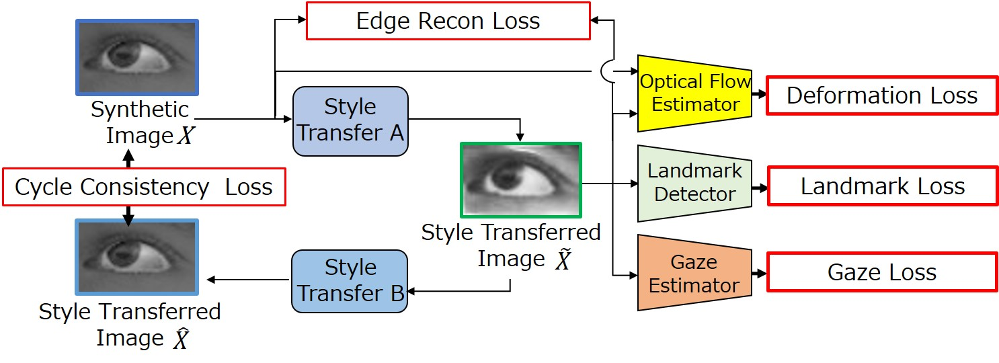

# Shape Preserving by Dense Pixel Correspondences in Image Style Transfer for Gaze Estimation


<!-- **Ours methhod.** -->


## Directories
```plain
SP/
    data/                           							 
        nuscenes/  ←dl001 datasetに有ります．               		    
                annotations/
                maps/
                samples/
                sweeps/
                v1.0-trainval/
        train_data/
                depth_complition_mlp2_aug4_neg_0.0 ←dl001 /kotani/workspace/DERURD/data/train_data/に有ります．
                depth_complition_hg_mlp2_aug4_neg_0.0 ←dl001 /kotani/workspace/DERURD/data/train_data/に有ります．
        mer/
                mer_2_30_5_0.5_mlp2_aug4_neg_0.0.h5 ←dl001 /kotani/workspace/DERURD/data/mer/に有ります．
    lib/
    scripts/
    external/                   				   	        
        panoptic-deeplab/       
        RAFT/                   	     				
```


## Setup
- Create a pyenv
```bash
cd DERUR
pyenv virtualenv  3.6.9 DERUR
pyenv local DERUR
```
- Install required packages
```bash
pip install --upgrade pip
pip install -r requirements.txt
```
- Download [nuScenes dataset](https://www.nuscenes.org/) (Full dataset (v1.0)) into data/nuscenes/
- Clone external repos [Panoptic-DeepLab](https://github.com/bowenc0221/panoptic-deeplab) and [RAFT](https://github.com/princeton-vl/RAFT)
into external/

## Code
1. Data preparation following Long et al. <br> The following procedure is actually required, but can be avoided by accessing <br>
**/kotani/workspace/DERURD/data/prepared_data.h5.**

```bash
cd scripts

# 1) split data
python split_trainval.py

# 2) extract images for flow computation
python prepare_flow_im.py

# 3) compute image flow from im1 to im2
python cal_flow.py 

# 4) compute camera intrinsic matrix and transformation from cam1 to cam2
python cal_cam_matrix.py 

# 5) transform image flow to normalized expression (u2,v2)
python cal_im_flow2uv.py  

# 6) compute vehicle semantic segmentation
python semantic_seg.py 

# 7) compute dense ground truth (depth1, u2, v2) and low height mask
python cal_gt.py  

# 8) compute merged radar (5 frames)
python cal_radar.py       

# 9) create .h5 dataset file
python gen_h5_file.py           
```

2. Estimate radar camera association
```bash
python train_pda.py        # train
python test_pda.py         # test
```
<!-- Download [pre-trained weights](https://) -->
Pre-trained weights is **"/kotani/workspace/DERURD/data/train_data/prepared_data.h5".**

3. Generate mapped radar data (MRD) <br> 
The following procedure is actually required, but can be avoided by accessing  <br> 
**"/kotani/workspace/DERURD/data/mer_2_30_5_0.5_mlp2_aug4_neg_0.0.h5".**

```bash
python cal_mer.py
```

4. Train depth completion by using the enhanced depth
- Depth completion scheme 1 ([Using depths and RGB as input channels](https://arxiv.org/pdf/1709.07492.pdf))

```bash
python train_depth.py        	# train
python test_depth.py         	# test
```
<!-- Download [pre-trained weights](https://) -->
Pre-trained weights is **"/kotani/workspace/DERURD/data/train_data/prepared_data.h5".**

- Depth completion scheme 2 ([Multi-Scale Guided Cascade Hourglass Network](https://github.com/anglixjtu/msg_chn_wacv20))

```bash
python train_depth_hg.py        # train
python test_depth_hg.py         # test
```
<!-- Download [pre-trained weights](https://). -->
Pre-trained weights is **"/kotani/workspace/DERURD/data/train_data/prepared_data.h5".**


## Citation
```plain

```


# SPL-ST_Gaze_Estimator
